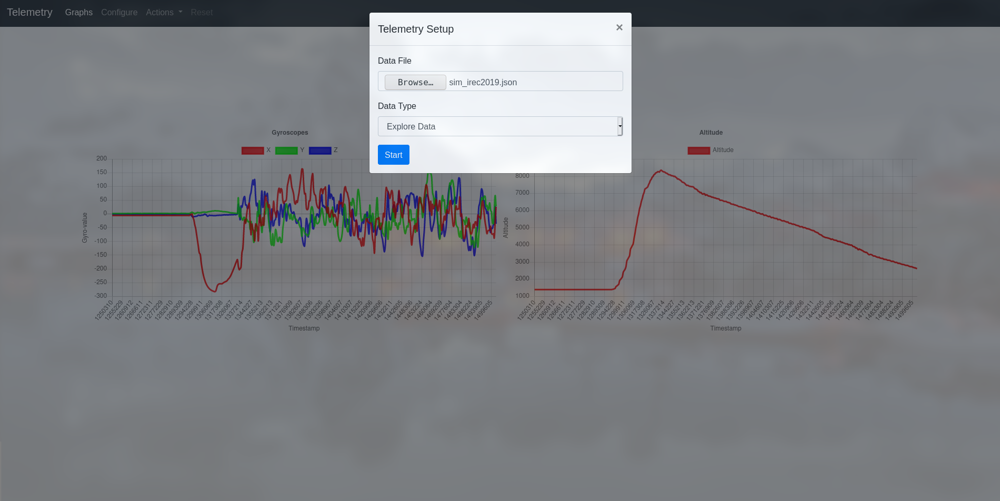

# Telemetry
Web app for CURE telemetry. 

All web-related dependencies are built-in, but python dependencies should be
installed with a virtual environment as shown below. 

### TODO
#### Features
* [x] View recorded data
* [x] Simulate recorded data
* [x] View live data
* [ ] Send commands to the system
#### Misc.
* [ ] Configuration within web app
* [ ] Reset button within web app
* [ ] More graphs/data types

### Setup
#### Web app
* Install `Python3.8` or higher
* Create a virtual environment with `python -m venv telemetry-env`
* Activate the virtual environment with `source telemetry-env/bin/activate`
* Install packages with `pip install -r requirements.txt`
* Start the server with `./run.sh`
* Visit `http://127.0.0.1:5000/` in a browser to use the app
* Quit with `ctrl+c` in the terminal
* Type `deactivate` to quit the virtual environment
#### Radios
xbee radio settings (remote addresses, etc.) can be found in `src/radio.py`

### Issues
The pip package for digi-xbee has had some issues lately.
If you get errors on the import, change line 230 of 
`telemetry-env/lib/python3.9/site-packages/digi/xbee/models/mode.py`
from 
`return sum(op.code for op in options if lambda option: option != cls.EXPLICIT)`
to
`return sum(op.code for op in options if op < cls.UNSUPPORTED_ZDO_PASSTHRU)`.
